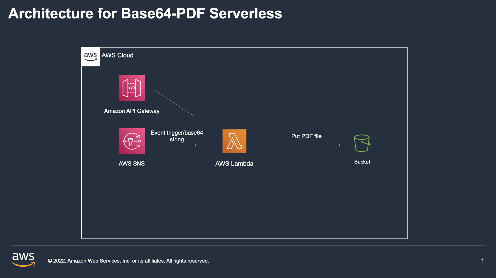
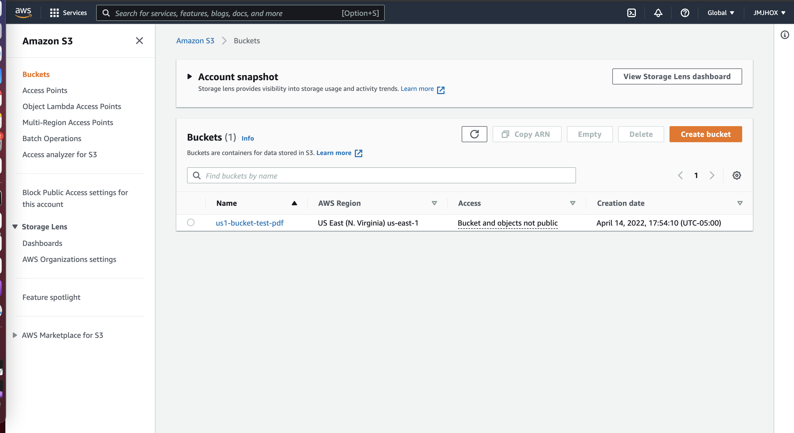
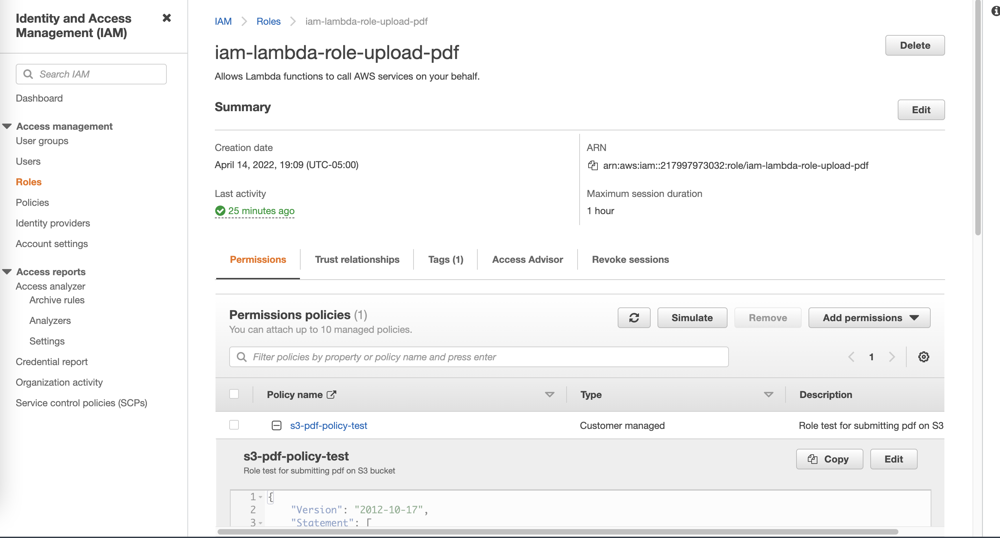
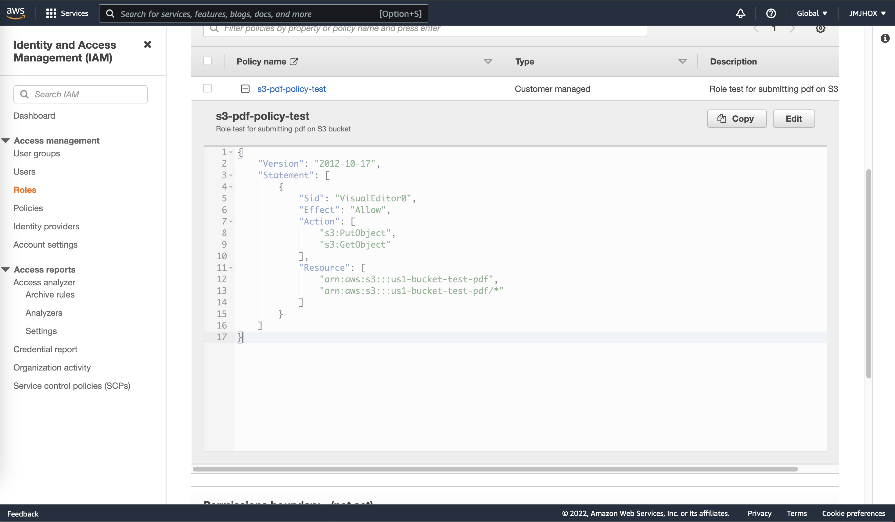
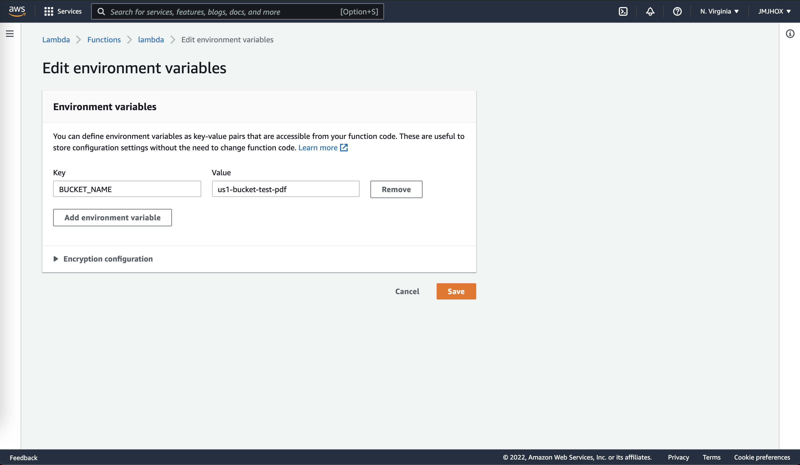
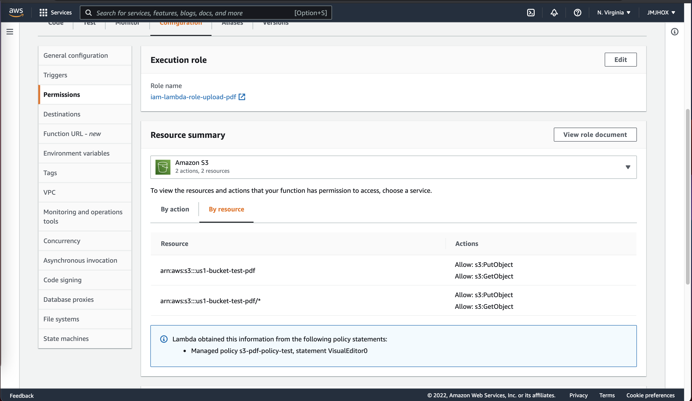
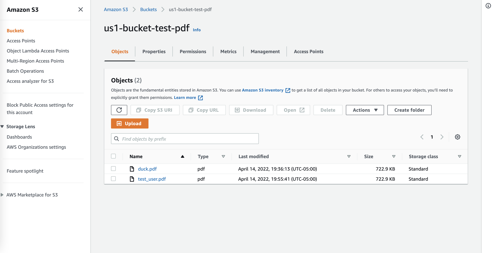

# Base64-PDF Serverless App

##### REMEMBER THIS PROJECT IS USING FREE TIER

Today, we are creating a function on AWS that receives a base64 string and uploads it to a s3 bucket and returns a s3 pre-signed link to access it if desired
<br><br>


### Architecture proposal
Our first proposal with be a classic architecture consisting on :

* An event trigger(i.e an Api Gateway, or other way to send a payload to our lambda) provinding a  base64 file string.
* A Lambda to process our base64 file and transforming into a PDF file.
* A S3 Bucket to store our pdf file





##
First, we´ll create our bucket to store our PDF´s generated by our lambda.


Next, we´ll create a IAM role to attach it to our lambda.

Our IAM Role will be using the next policy:


Next, we´ll be setting our environmet variables on our lambda to set our bucket name to be used on our lambda for the uploading part

This is how our lambda has to be configured.


For the testing part, we´ll be using this payload on our test creating environment:
```
TEST FOR ENV LAMBDA
{
  "filename": "value1",
  "base64" : "lambda"
}
```

Now, we have to submit our lambdafunction.zip into our AWS Lambda. for this moment, we´ll be submitting our python script located on python-scripts.
Finally, test the lambda and if have follow the previous steps correctly, we must see on our S3 Bucket a pdf.file submitted.

