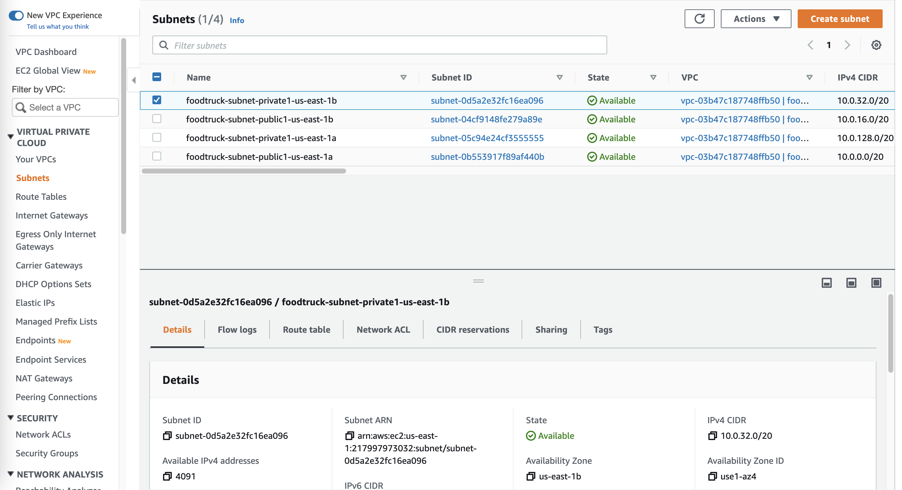

# Food Truck Web App

##### REMEMBER THIS PROJECT IS USING FREE TIER

There is a currently need with restaurants and food trucks to be employing the last technologies on their business to become more atractive for people and to low significantly costs on their operations and model of doing things.
The Food Truck App needs to be fully functional offline and heavily focused on mobile/tablet platforms.
  
Requirements to fullfill business model:

* Can be used as a digital menu(create, read, update and delete dishes on the menu)
*  checkout the user´s order and generate a PDF with it and be downloable
* It has to manage a sesion user system per company/person that can be scalable
* Store a backup and keep track of order´s history of clients per restaurant, and has to be synchronizable with the cloud and viceversa.

## Architecture proposal
Our first proposal with be a classic architecture consisting on a EC2 with the Web App deployed on the public subnet. 
Its purpose is to be able to communicate with the Internet Gateway and thus, users can be able to reach the App  
On the private subnet we´ll be using a RDS Instance to store our order´s history and be able to sinchronize RDS Instance´s data compared with the Web App, and  create backups with it. 
 
To provide high availability, we´ll be setting our RDS instance with Multi-AZ deployment failover. And to upload our app on the EC2 Instance, we´ll be employing a S3 Bucket to store our webapp.zip to be reachable for our app and be installed.

## Building our Infraestructure

First, we´ll start by creating our VPC on AWS with VPC Wizard by the name "foodtruck-vpc"

Within our VPC, we´ll create 2 subnets per Availability zone, a public subnet four our web app and a private subnet for our RDS.

Now, we´ll create our S3 Bucket to be consumed by our web app. It´s gonna be set to "public" by the time.

An important step on creating our bucket is bucket policy, we´ll be setting it can be retrieve our data on that bucket, but that´s it.

Now we´ll upload our webapp.zip to be consumed on our EC2 to be updated correctly(for now).

Second, we´ll launch our EC2 instance on our public subnet

We have to check for our security groups to be able to communicate using our web app and HTTP/HTTPS ports.

Remember to launch our RDS Instance on the private subnet

For our last step, we´ll have to SSH our EC2 and install our app manually(on our nexxt proposal we´ll automate all of this, this is for learning purpose)
